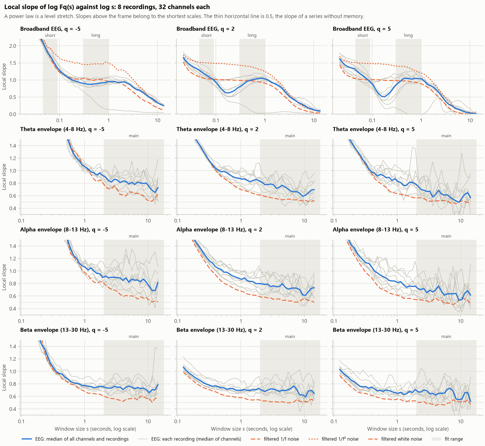
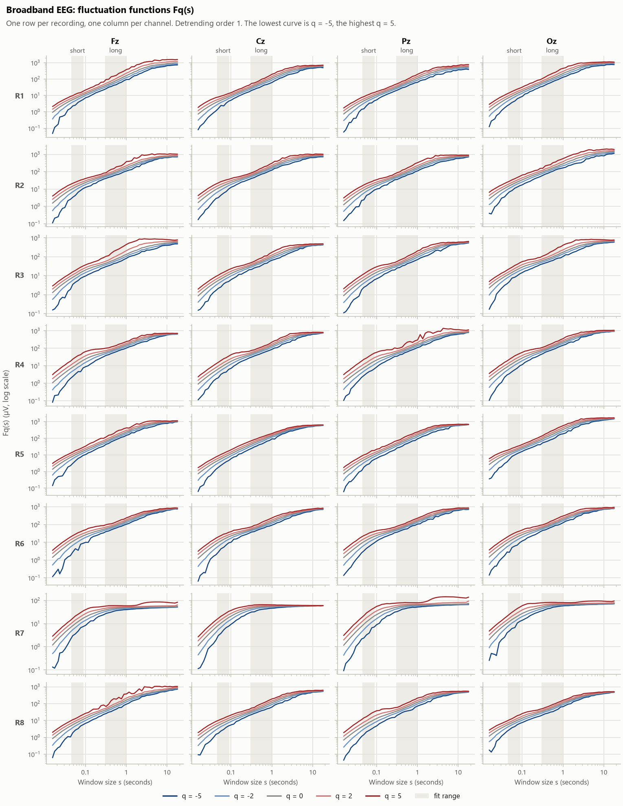
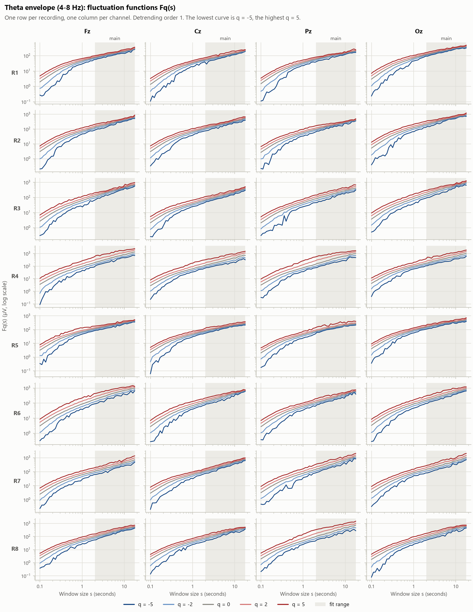
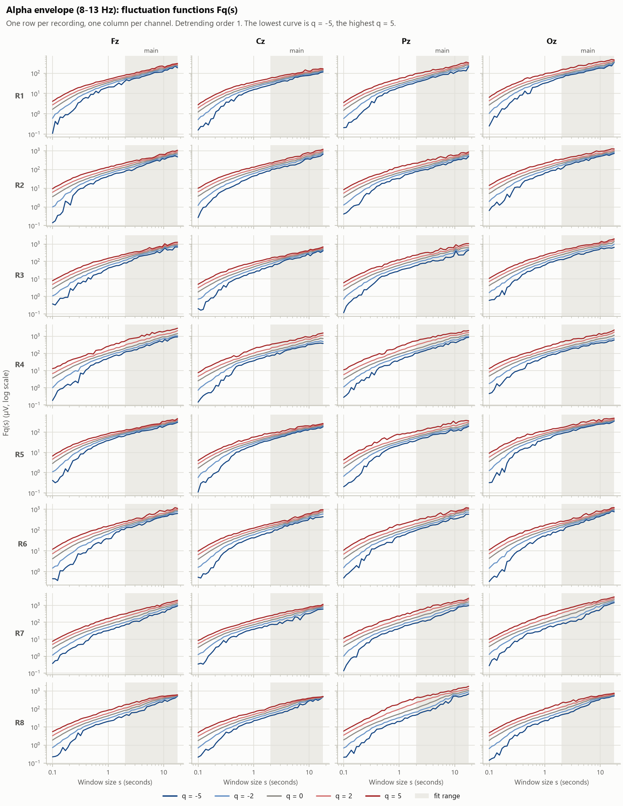
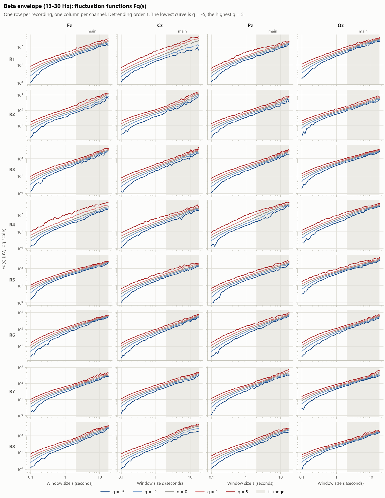

# MFDFA scaling inspection

Written by `pdeeg mfdfa-scaling`. 8 of the 46 recordings were picked at random (seed 20261009) and are called R1 to R8. No subject, session or group label was read to choose them or appears below, so nothing here can be tuned towards a group difference.

This report states what was measured. The fit ranges chosen from it, and the reasons, are in `configs/features/mfdfa.yaml`; the shaded bands in the figures are those ranges.

## What was computed

- **Recordings:** 180 s at 512 Hz (92160 samples), 32 channels, whole recording including the stretches marked bad.
- **Broadband:** the cleaned EEG as it is (0.5 to 50 Hz band-pass from preprocessing).
- **Envelope:** theta 4 to 8 Hz; alpha 8 to 13 Hz; beta 13 to 30 Hz. Zero-phase FIR band-pass with 2 Hz transitions (1.65 s long), modulus of the analytic signal, 1 s dropped from each end.
- **MFDFA:** detrending order 1, q = -5, -2, 0, 2, 5, 50 log-spaced window sizes from 0.016 s (broadband) or 0.1 s (envelope) to 0.1 of the series.
- **Local slope:** least-squares slope of log Fq against log s through 5 neighbouring scales.
- **Filtered noise:** 40 realisations each. For broadband, 1/f noise, 1/f² noise put through the preprocessing band-pass; unfiltered, such noise has the slope (beta + 1) / 2 at every scale and every q, so any departure is the filter's doing. For an envelope, white noise put through the same band-pass and Hilbert transform; it has no memory of its own, so any slope above 0.5 is the filter's doing.

## Local slopes

### Broadband EEG

Median over every channel of every recording; for the noises, the mean over realisations.

| s (s) | samples | EEG q=-5 | EEG q=2 | EEG q=5 | EEG q=2, 10-90 % | 1/f noise q=-5 | 1/f noise q=2 | 1/f noise q=5 | 1/f² noise q=-5 | 1/f² noise q=2 | 1/f² noise q=5 |
|---|---|---|---|---|---|---|---|---|---|---|---|
| 0.0215 | 11 | 2.99 | 1.66 | 1.62 | 1.49 to 1.82 | 3.04 | 1.53 | 1.44 | 3.11 | 1.74 | 1.69 |
| 0.0234 | 12 | 2.94 | 1.58 | 1.55 | 1.39 to 1.76 | 2.89 | 1.42 | 1.33 | 2.98 | 1.68 | 1.63 |
| 0.0273 | 14 | 2.75 | 1.48 | 1.45 | 1.25 to 1.68 | 2.78 | 1.28 | 1.19 | 2.88 | 1.61 | 1.57 |
| 0.0312 | 16 | 2.53 | 1.42 | 1.39 | 1.18 to 1.63 | 2.49 | 1.21 | 1.13 | 2.74 | 1.57 | 1.54 |
| 0.0371 | 19 | 2.35 | 1.36 | 1.36 | 1.12 to 1.57 | 2.28 | 1.15 | 1.07 | 2.63 | 1.55 | 1.52 |
| 0.043 | 22 | 2.18 | 1.31 | 1.33 | 1.08 to 1.51 | 2.14 | 1.11 | 1.04 | 2.44 | 1.53 | 1.51 |
| 0.0488 | 25 | 2.00 | 1.25 | 1.25 | 1.03 to 1.45 | 1.99 | 1.08 | 1.03 | 2.13 | 1.51 | 1.50 |
| 0.0566 | 29 | 1.80 | 1.18 | 1.18 | 1.00 to 1.40 | 1.84 | 1.05 | 1.02 | 1.95 | 1.50 | 1.49 |
| 0.0664 | 34 | 1.67 | 1.12 | 1.11 | 0.96 to 1.33 | 1.60 | 1.04 | 1.01 | 1.90 | 1.50 | 1.49 |
| 0.0762 | 39 | 1.52 | 1.07 | 1.04 | 0.91 to 1.25 | 1.44 | 1.03 | 1.01 | 1.78 | 1.49 | 1.49 |
| 0.0879 | 45 | 1.37 | 1.02 | 0.96 | 0.83 to 1.15 | 1.30 | 1.02 | 1.00 | 1.72 | 1.49 | 1.48 |
| 0.102 | 52 | 1.27 | 0.92 | 0.87 | 0.76 to 1.06 | 1.21 | 1.02 | 1.01 | 1.62 | 1.48 | 1.48 |
| 0.117 | 60 | 1.18 | 0.81 | 0.72 | 0.67 to 1.03 | 1.17 | 1.01 | 1.01 | 1.59 | 1.48 | 1.47 |
| 0.135 | 69 | 1.12 | 0.71 | 0.60 | 0.55 to 1.02 | 1.11 | 1.01 | 1.00 | 1.56 | 1.48 | 1.48 |
| 0.156 | 80 | 1.05 | 0.63 | 0.52 | 0.44 to 1.02 | 1.08 | 1.00 | 1.00 | 1.55 | 1.47 | 1.47 |
| 0.18 | 92 | 1.00 | 0.62 | 0.51 | 0.38 to 1.03 | 1.05 | 1.00 | 0.99 | 1.53 | 1.46 | 1.46 |
| 0.209 | 107 | 0.97 | 0.65 | 0.58 | 0.37 to 1.04 | 1.03 | 1.00 | 0.98 | 1.49 | 1.46 | 1.45 |
| 0.24 | 123 | 0.94 | 0.69 | 0.66 | 0.39 to 1.07 | 1.02 | 0.99 | 0.99 | 1.51 | 1.45 | 1.44 |
| 0.277 | 142 | 0.91 | 0.77 | 0.79 | 0.38 to 1.10 | 1.04 | 0.99 | 0.99 | 1.46 | 1.44 | 1.42 |
| 0.32 | 164 | 0.89 | 0.82 | 0.88 | 0.35 to 1.12 | 1.05 | 0.99 | 0.98 | 1.46 | 1.43 | 1.40 |
| 0.371 | 190 | 0.88 | 0.88 | 0.95 | 0.30 to 1.16 | 1.02 | 0.98 | 0.98 | 1.45 | 1.41 | 1.39 |
| 0.428 | 219 | 0.87 | 0.96 | 1.04 | 0.23 to 1.17 | 1.01 | 0.98 | 0.97 | 1.46 | 1.41 | 1.40 |
| 0.494 | 253 | 0.88 | 0.98 | 1.05 | 0.15 to 1.20 | 0.99 | 0.98 | 0.98 | 1.47 | 1.39 | 1.39 |
| 0.57 | 292 | 0.89 | 1.01 | 1.04 | 0.08 to 1.21 | 1.01 | 0.97 | 0.96 | 1.47 | 1.37 | 1.35 |
| 0.658 | 337 | 0.90 | 1.03 | 1.03 | 0.04 to 1.21 | 1.01 | 0.96 | 0.95 | 1.47 | 1.35 | 1.31 |
| 0.76 | 389 | 0.92 | 1.04 | 1.05 | 0.03 to 1.21 | 1.00 | 0.95 | 0.93 | 1.47 | 1.31 | 1.26 |
| 0.877 | 449 | 0.92 | 1.05 | 1.04 | 0.03 to 1.21 | 0.98 | 0.93 | 0.90 | 1.53 | 1.29 | 1.24 |
| 1.01 | 519 | 0.96 | 1.03 | 1.03 | 0.05 to 1.19 | 0.95 | 0.91 | 0.89 | 1.49 | 1.24 | 1.20 |
| 1.17 | 599 | 0.95 | 1.00 | 0.96 | 0.06 to 1.12 | 0.95 | 0.87 | 0.84 | 1.45 | 1.20 | 1.16 |
| 1.35 | 692 | 0.95 | 0.93 | 0.87 | 0.07 to 1.12 | 0.94 | 0.83 | 0.79 | 1.37 | 1.13 | 1.09 |
| 1.56 | 799 | 0.92 | 0.90 | 0.83 | 0.09 to 1.08 | 0.92 | 0.78 | 0.73 | 1.29 | 1.07 | 1.01 |
| 1.8 | 922 | 0.93 | 0.85 | 0.79 | 0.11 to 1.02 | 0.92 | 0.71 | 0.64 | 1.30 | 0.98 | 0.90 |
| 2.08 | 1065 | 0.95 | 0.80 | 0.70 | 0.13 to 0.95 | 0.85 | 0.63 | 0.55 | 1.27 | 0.89 | 0.80 |
| 2.4 | 1230 | 0.91 | 0.71 | 0.60 | 0.15 to 0.85 | 0.78 | 0.55 | 0.47 | 1.21 | 0.79 | 0.69 |
| 2.77 | 1420 | 0.86 | 0.60 | 0.49 | 0.15 to 0.76 | 0.72 | 0.47 | 0.38 | 1.10 | 0.68 | 0.58 |
| 3.2 | 1640 | 0.78 | 0.51 | 0.36 | 0.14 to 0.68 | 0.64 | 0.38 | 0.28 | 1.01 | 0.58 | 0.48 |
| 3.7 | 1894 | 0.72 | 0.45 | 0.29 | 0.11 to 0.60 | 0.58 | 0.29 | 0.18 | 0.90 | 0.47 | 0.36 |
| 4.27 | 2187 | 0.70 | 0.39 | 0.24 | 0.09 to 0.55 | 0.49 | 0.22 | 0.12 | 0.81 | 0.38 | 0.27 |
| 4.93 | 2525 | 0.64 | 0.33 | 0.17 | 0.08 to 0.51 | 0.43 | 0.16 | 0.07 | 0.73 | 0.32 | 0.19 |
| 5.7 | 2916 | 0.58 | 0.29 | 0.14 | 0.06 to 0.47 | 0.37 | 0.13 | 0.05 | 0.61 | 0.26 | 0.14 |
| 6.58 | 3367 | 0.50 | 0.24 | 0.12 | 0.06 to 0.45 | 0.35 | 0.10 | 0.03 | 0.54 | 0.21 | 0.10 |
| 7.59 | 3888 | 0.46 | 0.19 | 0.07 | 0.05 to 0.39 | 0.29 | 0.08 | 0.02 | 0.44 | 0.17 | 0.08 |
| 8.77 | 4489 | 0.40 | 0.16 | 0.05 | 0.04 to 0.33 | 0.23 | 0.06 | 0.01 | 0.37 | 0.14 | 0.06 |
| 10.1 | 5184 | 0.33 | 0.13 | 0.03 | 0.04 to 0.25 | 0.19 | 0.05 | -0.00 | 0.32 | 0.12 | 0.05 |
| 11.7 | 5986 | 0.28 | 0.10 | 0.02 | 0.03 to 0.20 | 0.14 | 0.04 | -0.01 | 0.27 | 0.09 | 0.03 |
| 13.5 | 6912 | 0.24 | 0.10 | 0.01 | 0.04 to 0.19 | 0.13 | 0.03 | -0.01 | 0.25 | 0.08 | 0.03 |

### Theta envelope (4-8 Hz)

Median over every channel of every recording; for the noises, the mean over realisations.

| s (s) | samples | EEG q=-5 | EEG q=2 | EEG q=5 | EEG q=2, 10-90 % | white noise q=-5 | white noise q=2 | white noise q=5 |
|---|---|---|---|---|---|---|---|---|
| 0.123 | 63 | 2.74 | 1.74 | 1.72 | 1.70 to 1.78 | 2.90 | 1.75 | 1.72 |
| 0.137 | 70 | 2.78 | 1.70 | 1.66 | 1.66 to 1.73 | 2.76 | 1.71 | 1.66 |
| 0.152 | 78 | 2.83 | 1.65 | 1.61 | 1.60 to 1.69 | 2.82 | 1.66 | 1.61 |
| 0.17 | 87 | 2.61 | 1.59 | 1.53 | 1.53 to 1.64 | 2.72 | 1.60 | 1.54 |
| 0.188 | 96 | 2.72 | 1.52 | 1.46 | 1.46 to 1.58 | 2.73 | 1.53 | 1.46 |
| 0.209 | 107 | 2.64 | 1.45 | 1.38 | 1.39 to 1.51 | 2.66 | 1.46 | 1.38 |
| 0.232 | 119 | 2.69 | 1.38 | 1.32 | 1.31 to 1.45 | 2.64 | 1.39 | 1.31 |
| 0.258 | 132 | 2.54 | 1.30 | 1.25 | 1.23 to 1.39 | 2.61 | 1.30 | 1.23 |
| 0.287 | 147 | 2.38 | 1.23 | 1.17 | 1.14 to 1.31 | 2.44 | 1.22 | 1.16 |
| 0.318 | 163 | 2.22 | 1.16 | 1.11 | 1.09 to 1.26 | 2.36 | 1.15 | 1.09 |
| 0.355 | 182 | 2.03 | 1.10 | 1.03 | 1.01 to 1.20 | 2.17 | 1.07 | 1.02 |
| 0.395 | 202 | 2.10 | 1.04 | 0.98 | 0.96 to 1.14 | 2.26 | 1.01 | 0.96 |
| 0.438 | 224 | 1.91 | 1.01 | 0.96 | 0.93 to 1.12 | 2.21 | 0.96 | 0.88 |
| 0.486 | 249 | 1.72 | 0.98 | 0.91 | 0.89 to 1.11 | 1.90 | 0.91 | 0.83 |
| 0.541 | 277 | 1.50 | 0.99 | 0.94 | 0.87 to 1.13 | 1.58 | 0.88 | 0.80 |
| 0.602 | 308 | 1.37 | 0.97 | 0.92 | 0.84 to 1.15 | 1.39 | 0.84 | 0.77 |
| 0.67 | 343 | 1.27 | 0.93 | 0.89 | 0.80 to 1.10 | 1.31 | 0.81 | 0.73 |
| 0.744 | 381 | 1.20 | 0.90 | 0.89 | 0.78 to 1.07 | 1.28 | 0.78 | 0.68 |
| 0.826 | 423 | 1.15 | 0.89 | 0.84 | 0.77 to 1.05 | 1.21 | 0.74 | 0.65 |
| 0.92 | 471 | 1.09 | 0.88 | 0.87 | 0.76 to 1.06 | 1.08 | 0.72 | 0.64 |
| 1.02 | 523 | 1.06 | 0.87 | 0.83 | 0.72 to 1.04 | 1.07 | 0.70 | 0.63 |
| 1.14 | 582 | 1.03 | 0.87 | 0.81 | 0.70 to 1.02 | 1.01 | 0.68 | 0.62 |
| 1.26 | 647 | 0.98 | 0.84 | 0.76 | 0.66 to 1.02 | 0.93 | 0.67 | 0.61 |
| 1.4 | 719 | 0.96 | 0.82 | 0.76 | 0.67 to 0.99 | 0.86 | 0.65 | 0.60 |
| 1.56 | 799 | 0.93 | 0.84 | 0.81 | 0.69 to 1.02 | 0.82 | 0.64 | 0.59 |
| 1.73 | 888 | 0.96 | 0.86 | 0.81 | 0.67 to 1.06 | 0.85 | 0.62 | 0.57 |
| 1.93 | 987 | 0.92 | 0.84 | 0.79 | 0.65 to 1.09 | 0.81 | 0.61 | 0.57 |
| 2.14 | 1098 | 0.89 | 0.82 | 0.75 | 0.61 to 0.96 | 0.74 | 0.60 | 0.57 |
| 2.38 | 1220 | 0.84 | 0.78 | 0.70 | 0.62 to 0.94 | 0.71 | 0.59 | 0.56 |
| 2.65 | 1356 | 0.82 | 0.78 | 0.69 | 0.59 to 0.93 | 0.71 | 0.58 | 0.55 |
| 2.95 | 1508 | 0.86 | 0.79 | 0.67 | 0.60 to 0.95 | 0.75 | 0.57 | 0.53 |
| 3.27 | 1676 | 0.85 | 0.77 | 0.67 | 0.58 to 0.97 | 0.70 | 0.56 | 0.51 |
| 3.64 | 1863 | 0.81 | 0.72 | 0.58 | 0.58 to 0.90 | 0.62 | 0.55 | 0.51 |
| 4.04 | 2071 | 0.83 | 0.74 | 0.62 | 0.58 to 0.92 | 0.61 | 0.54 | 0.51 |
| 4.5 | 2302 | 0.83 | 0.77 | 0.69 | 0.49 to 0.99 | 0.60 | 0.53 | 0.52 |
| 5 | 2559 | 0.79 | 0.74 | 0.63 | 0.48 to 0.94 | 0.66 | 0.54 | 0.52 |
| 5.56 | 2845 | 0.81 | 0.71 | 0.61 | 0.49 to 0.94 | 0.66 | 0.55 | 0.52 |
| 6.18 | 3163 | 0.78 | 0.67 | 0.61 | 0.50 to 0.90 | 0.63 | 0.54 | 0.52 |
| 6.87 | 3516 | 0.82 | 0.66 | 0.58 | 0.50 to 0.86 | 0.64 | 0.53 | 0.49 |
| 7.63 | 3908 | 0.80 | 0.67 | 0.54 | 0.48 to 0.83 | 0.61 | 0.53 | 0.49 |
| 8.48 | 4344 | 0.80 | 0.64 | 0.52 | 0.43 to 0.88 | 0.60 | 0.52 | 0.47 |
| 9.43 | 4829 | 0.80 | 0.59 | 0.49 | 0.41 to 0.90 | 0.54 | 0.51 | 0.50 |
| 10.5 | 5369 | 0.74 | 0.61 | 0.56 | 0.40 to 0.95 | 0.51 | 0.52 | 0.52 |
| 11.7 | 5968 | 0.69 | 0.65 | 0.62 | 0.43 to 0.92 | 0.51 | 0.51 | 0.51 |
| 13 | 6634 | 0.65 | 0.69 | 0.65 | 0.46 to 0.92 | 0.57 | 0.51 | 0.49 |
| 14.4 | 7375 | 0.73 | 0.70 | 0.57 | 0.43 to 0.97 | 0.63 | 0.53 | 0.50 |

### Alpha envelope (8-13 Hz)

Median over every channel of every recording; for the noises, the mean over realisations.

| s (s) | samples | EEG q=-5 | EEG q=2 | EEG q=5 | EEG q=2, 10-90 % | white noise q=-5 | white noise q=2 | white noise q=5 |
|---|---|---|---|---|---|---|---|---|
| 0.123 | 63 | 2.60 | 1.72 | 1.70 | 1.67 to 1.77 | 2.81 | 1.68 | 1.63 |
| 0.137 | 70 | 2.69 | 1.67 | 1.63 | 1.62 to 1.72 | 2.76 | 1.63 | 1.58 |
| 0.152 | 78 | 2.74 | 1.62 | 1.57 | 1.57 to 1.68 | 2.67 | 1.57 | 1.51 |
| 0.17 | 87 | 2.61 | 1.56 | 1.51 | 1.49 to 1.65 | 2.52 | 1.50 | 1.43 |
| 0.188 | 96 | 2.73 | 1.49 | 1.42 | 1.41 to 1.57 | 2.78 | 1.41 | 1.34 |
| 0.209 | 107 | 2.65 | 1.42 | 1.37 | 1.35 to 1.52 | 2.72 | 1.33 | 1.26 |
| 0.232 | 119 | 2.69 | 1.35 | 1.29 | 1.26 to 1.46 | 2.67 | 1.26 | 1.18 |
| 0.258 | 132 | 2.54 | 1.28 | 1.23 | 1.18 to 1.42 | 2.53 | 1.18 | 1.11 |
| 0.287 | 147 | 2.35 | 1.22 | 1.18 | 1.13 to 1.38 | 2.20 | 1.11 | 1.04 |
| 0.318 | 163 | 2.22 | 1.16 | 1.13 | 1.07 to 1.30 | 2.06 | 1.04 | 0.98 |
| 0.355 | 182 | 1.96 | 1.13 | 1.12 | 1.01 to 1.26 | 1.89 | 0.99 | 0.93 |
| 0.395 | 202 | 1.92 | 1.07 | 1.07 | 0.96 to 1.22 | 1.95 | 0.94 | 0.89 |
| 0.438 | 224 | 1.75 | 1.04 | 1.00 | 0.91 to 1.19 | 1.87 | 0.89 | 0.83 |
| 0.486 | 249 | 1.58 | 1.03 | 0.97 | 0.89 to 1.20 | 1.73 | 0.84 | 0.77 |
| 0.541 | 277 | 1.49 | 0.98 | 0.93 | 0.87 to 1.16 | 1.46 | 0.81 | 0.72 |
| 0.602 | 308 | 1.36 | 0.98 | 0.91 | 0.84 to 1.13 | 1.27 | 0.78 | 0.70 |
| 0.67 | 343 | 1.25 | 0.95 | 0.89 | 0.80 to 1.13 | 1.23 | 0.76 | 0.68 |
| 0.744 | 381 | 1.20 | 0.92 | 0.85 | 0.79 to 1.08 | 1.15 | 0.73 | 0.65 |
| 0.826 | 423 | 1.12 | 0.90 | 0.84 | 0.77 to 1.06 | 1.12 | 0.71 | 0.63 |
| 0.92 | 471 | 1.08 | 0.89 | 0.84 | 0.74 to 1.07 | 1.00 | 0.69 | 0.62 |
| 1.02 | 523 | 1.06 | 0.87 | 0.81 | 0.73 to 1.03 | 0.97 | 0.68 | 0.61 |
| 1.14 | 582 | 1.02 | 0.89 | 0.83 | 0.71 to 1.04 | 0.93 | 0.66 | 0.60 |
| 1.26 | 647 | 1.05 | 0.85 | 0.78 | 0.68 to 1.01 | 0.87 | 0.63 | 0.56 |
| 1.4 | 719 | 1.00 | 0.83 | 0.74 | 0.69 to 0.99 | 0.82 | 0.63 | 0.56 |
| 1.56 | 799 | 0.96 | 0.83 | 0.76 | 0.66 to 1.00 | 0.81 | 0.62 | 0.56 |
| 1.73 | 888 | 0.96 | 0.80 | 0.75 | 0.65 to 1.03 | 0.83 | 0.61 | 0.55 |
| 1.93 | 987 | 0.90 | 0.80 | 0.76 | 0.62 to 1.09 | 0.82 | 0.60 | 0.54 |
| 2.14 | 1098 | 0.92 | 0.79 | 0.72 | 0.60 to 1.00 | 0.77 | 0.58 | 0.54 |
| 2.38 | 1220 | 0.89 | 0.79 | 0.70 | 0.61 to 1.00 | 0.74 | 0.58 | 0.54 |
| 2.65 | 1356 | 0.90 | 0.79 | 0.72 | 0.61 to 1.02 | 0.71 | 0.57 | 0.53 |
| 2.95 | 1508 | 0.90 | 0.75 | 0.65 | 0.62 to 0.99 | 0.70 | 0.57 | 0.53 |
| 3.27 | 1676 | 0.89 | 0.76 | 0.69 | 0.62 to 1.03 | 0.67 | 0.55 | 0.50 |
| 3.64 | 1863 | 0.89 | 0.75 | 0.67 | 0.62 to 0.94 | 0.63 | 0.55 | 0.54 |
| 4.04 | 2071 | 0.85 | 0.75 | 0.70 | 0.60 to 0.94 | 0.59 | 0.55 | 0.57 |
| 4.5 | 2302 | 0.89 | 0.80 | 0.76 | 0.57 to 1.02 | 0.61 | 0.53 | 0.53 |
| 5 | 2559 | 0.82 | 0.74 | 0.67 | 0.53 to 0.98 | 0.60 | 0.54 | 0.54 |
| 5.56 | 2845 | 0.87 | 0.71 | 0.61 | 0.55 to 0.98 | 0.60 | 0.52 | 0.48 |
| 6.18 | 3163 | 0.85 | 0.72 | 0.63 | 0.57 to 0.90 | 0.59 | 0.52 | 0.50 |
| 6.87 | 3516 | 0.86 | 0.73 | 0.64 | 0.54 to 1.00 | 0.55 | 0.51 | 0.48 |
| 7.63 | 3908 | 0.83 | 0.73 | 0.64 | 0.52 to 0.96 | 0.59 | 0.50 | 0.46 |
| 8.48 | 4344 | 0.87 | 0.70 | 0.64 | 0.45 to 0.98 | 0.57 | 0.52 | 0.49 |
| 9.43 | 4829 | 0.82 | 0.62 | 0.53 | 0.41 to 0.87 | 0.57 | 0.55 | 0.53 |
| 10.5 | 5369 | 0.76 | 0.61 | 0.54 | 0.39 to 0.84 | 0.53 | 0.55 | 0.57 |
| 11.7 | 5968 | 0.69 | 0.67 | 0.65 | 0.47 to 0.86 | 0.50 | 0.53 | 0.55 |
| 13 | 6634 | 0.69 | 0.73 | 0.68 | 0.49 to 0.89 | 0.52 | 0.52 | 0.53 |
| 14.4 | 7375 | 0.82 | 0.73 | 0.61 | 0.50 to 1.00 | 0.51 | 0.50 | 0.47 |

### Beta envelope (13-30 Hz)

Median over every channel of every recording; for the noises, the mean over realisations.

| s (s) | samples | EEG q=-5 | EEG q=2 | EEG q=5 | EEG q=2, 10-90 % | white noise q=-5 | white noise q=2 | white noise q=5 |
|---|---|---|---|---|---|---|---|---|
| 0.123 | 63 | 2.08 | 1.07 | 1.03 | 1.00 to 1.22 | 2.27 | 0.99 | 0.94 |
| 0.137 | 70 | 2.04 | 1.01 | 0.98 | 0.95 to 1.15 | 2.10 | 0.94 | 0.88 |
| 0.152 | 78 | 1.88 | 0.97 | 0.94 | 0.90 to 1.11 | 1.95 | 0.90 | 0.83 |
| 0.17 | 87 | 1.70 | 0.94 | 0.90 | 0.87 to 1.08 | 1.68 | 0.87 | 0.79 |
| 0.188 | 96 | 1.56 | 0.90 | 0.86 | 0.83 to 1.03 | 1.60 | 0.82 | 0.75 |
| 0.209 | 107 | 1.43 | 0.87 | 0.83 | 0.80 to 0.99 | 1.52 | 0.79 | 0.72 |
| 0.232 | 119 | 1.36 | 0.85 | 0.80 | 0.77 to 0.96 | 1.32 | 0.76 | 0.67 |
| 0.258 | 132 | 1.25 | 0.81 | 0.76 | 0.74 to 0.93 | 1.18 | 0.74 | 0.66 |
| 0.287 | 147 | 1.13 | 0.80 | 0.75 | 0.71 to 0.91 | 1.10 | 0.72 | 0.65 |
| 0.318 | 163 | 1.06 | 0.78 | 0.76 | 0.70 to 0.90 | 1.02 | 0.71 | 0.65 |
| 0.355 | 182 | 0.99 | 0.76 | 0.73 | 0.69 to 0.88 | 0.97 | 0.69 | 0.63 |
| 0.395 | 202 | 0.97 | 0.77 | 0.75 | 0.68 to 0.88 | 0.96 | 0.67 | 0.61 |
| 0.438 | 224 | 0.96 | 0.75 | 0.72 | 0.68 to 0.86 | 0.88 | 0.66 | 0.61 |
| 0.486 | 249 | 0.91 | 0.74 | 0.69 | 0.67 to 0.84 | 0.86 | 0.63 | 0.58 |
| 0.541 | 277 | 0.88 | 0.74 | 0.69 | 0.65 to 0.82 | 0.82 | 0.62 | 0.58 |
| 0.602 | 308 | 0.84 | 0.72 | 0.68 | 0.64 to 0.84 | 0.80 | 0.60 | 0.56 |
| 0.67 | 343 | 0.82 | 0.73 | 0.70 | 0.64 to 0.85 | 0.79 | 0.60 | 0.56 |
| 0.744 | 381 | 0.81 | 0.72 | 0.69 | 0.62 to 0.88 | 0.75 | 0.60 | 0.56 |
| 0.826 | 423 | 0.80 | 0.70 | 0.68 | 0.62 to 0.85 | 0.72 | 0.59 | 0.54 |
| 0.92 | 471 | 0.77 | 0.70 | 0.66 | 0.62 to 0.83 | 0.70 | 0.58 | 0.55 |
| 1.02 | 523 | 0.77 | 0.70 | 0.65 | 0.61 to 0.81 | 0.68 | 0.58 | 0.56 |
| 1.14 | 582 | 0.76 | 0.71 | 0.67 | 0.61 to 0.83 | 0.65 | 0.57 | 0.55 |
| 1.26 | 647 | 0.76 | 0.70 | 0.63 | 0.60 to 0.79 | 0.65 | 0.55 | 0.53 |
| 1.4 | 719 | 0.74 | 0.70 | 0.64 | 0.58 to 0.81 | 0.64 | 0.54 | 0.52 |
| 1.56 | 799 | 0.75 | 0.71 | 0.68 | 0.58 to 0.84 | 0.64 | 0.54 | 0.53 |
| 1.73 | 888 | 0.76 | 0.71 | 0.66 | 0.60 to 0.88 | 0.64 | 0.55 | 0.53 |
| 1.93 | 987 | 0.76 | 0.72 | 0.71 | 0.60 to 0.92 | 0.61 | 0.55 | 0.53 |
| 2.14 | 1098 | 0.74 | 0.70 | 0.67 | 0.59 to 0.86 | 0.59 | 0.53 | 0.50 |
| 2.38 | 1220 | 0.73 | 0.68 | 0.67 | 0.57 to 0.87 | 0.58 | 0.53 | 0.51 |
| 2.65 | 1356 | 0.73 | 0.70 | 0.70 | 0.58 to 0.89 | 0.57 | 0.53 | 0.52 |
| 2.95 | 1508 | 0.76 | 0.72 | 0.69 | 0.58 to 0.90 | 0.56 | 0.51 | 0.48 |
| 3.27 | 1676 | 0.75 | 0.72 | 0.64 | 0.58 to 0.95 | 0.55 | 0.52 | 0.48 |
| 3.64 | 1863 | 0.75 | 0.70 | 0.65 | 0.57 to 0.95 | 0.54 | 0.51 | 0.47 |
| 4.04 | 2071 | 0.71 | 0.68 | 0.62 | 0.56 to 0.89 | 0.52 | 0.50 | 0.45 |
| 4.5 | 2302 | 0.75 | 0.70 | 0.65 | 0.56 to 0.92 | 0.55 | 0.52 | 0.47 |
| 5 | 2559 | 0.77 | 0.69 | 0.65 | 0.55 to 0.91 | 0.56 | 0.50 | 0.47 |
| 5.56 | 2845 | 0.75 | 0.71 | 0.65 | 0.56 to 0.98 | 0.57 | 0.50 | 0.46 |
| 6.18 | 3163 | 0.72 | 0.73 | 0.71 | 0.56 to 0.95 | 0.57 | 0.50 | 0.49 |
| 6.87 | 3516 | 0.74 | 0.77 | 0.73 | 0.57 to 1.00 | 0.54 | 0.51 | 0.50 |
| 7.63 | 3908 | 0.72 | 0.71 | 0.68 | 0.50 to 0.96 | 0.60 | 0.55 | 0.55 |
| 8.48 | 4344 | 0.73 | 0.62 | 0.56 | 0.36 to 1.01 | 0.60 | 0.52 | 0.52 |
| 9.43 | 4829 | 0.71 | 0.63 | 0.55 | 0.43 to 0.86 | 0.57 | 0.52 | 0.52 |
| 10.5 | 5369 | 0.66 | 0.59 | 0.56 | 0.42 to 0.88 | 0.56 | 0.51 | 0.51 |
| 11.7 | 5968 | 0.71 | 0.68 | 0.66 | 0.47 to 0.98 | 0.51 | 0.52 | 0.52 |
| 13 | 6634 | 0.70 | 0.70 | 0.66 | 0.43 to 0.97 | 0.57 | 0.56 | 0.54 |
| 14.4 | 7375 | 0.79 | 0.65 | 0.52 | 0.46 to 0.87 | 0.58 | 0.52 | 0.48 |

## Fits over the configured ranges

h(q) fitted for q from -5 to 5 in steps of 0.5 on 12 scales per range. Each cell is the median with the 10th and 90th percentile in brackets, over the channels of all recordings (EEG) or over the realisations (noise). min R² is the worst R² over q.

| Series | Fit range | Scales (samples) | Source | Fits | h(-5) | h(2) | h(5) | delta_alpha | min R² | min R² < 0.9 |
|---|---|---|---|---|---|---|---|---|---|---|
| broadband | short: 0.045 to 0.09 s | 24 to 46 (12; series 92160) | EEG | 256 | 1.65 [1.45, 1.94] | 1.13 [0.96, 1.34] | 1.13 [0.89, 1.34] | 1.07 [0.57, 1.85] | 0.97 [0.91, 0.99] | 7 % |
| broadband | short: 0.045 to 0.09 s | 24 to 46 (12; series 92160) | 1/f noise | 40 | 1.56 [1.45, 1.74] | 1.04 [1.02, 1.05] | 1.02 [0.98, 1.04] | 1.08 [0.77, 1.71] | 0.98 [0.94, 0.99] | 2 % |
| broadband | short: 0.045 to 0.09 s | 24 to 46 (12; series 92160) | 1/f² noise | 40 | 1.84 [1.67, 2.12] | 1.50 [1.49, 1.51] | 1.49 [1.47, 1.51] | 0.73 [0.31, 1.47] | 0.97 [0.93, 0.99] | 2 % |
| broadband | long: 0.3 to 1 s | 154 to 512 (12; series 92160) | EEG | 256 | 0.91 [0.38, 1.09] | 0.99 [0.13, 1.18] | 1.05 [0.05, 1.29] | 0.32 [0.11, 0.66] | 0.99 [0.50, 0.99] | 14 % |
| broadband | long: 0.3 to 1 s | 154 to 512 (12; series 92160) | 1/f noise | 40 | 1.00 [0.94, 1.07] | 0.97 [0.94, 1.00] | 0.96 [0.92, 0.99] | 0.12 [0.07, 0.28] | 0.99 [0.99, 1.00] | 0 % |
| broadband | long: 0.3 to 1 s | 154 to 512 (12; series 92160) | 1/f² noise | 40 | 1.48 [1.35, 1.58] | 1.37 [1.32, 1.40] | 1.34 [1.29, 1.37] | 0.26 [0.12, 0.49] | 0.99 [0.97, 1.00] | 0 % |
| theta | main: 2 to 17.8 s | 1024 to 9113 (12; series 91136) | EEG | 256 | 0.84 [0.65, 0.99] | 0.70 [0.56, 0.85] | 0.62 [0.50, 0.79] | 0.35 [0.15, 0.63] | 0.97 [0.92, 0.98] | 8 % |
| theta | main: 2 to 17.8 s | 1024 to 9113 (12; series 91136) | white noise | 40 | 0.62 [0.55, 0.69] | 0.54 [0.48, 0.61] | 0.52 [0.43, 0.59] | 0.19 [0.08, 0.35] | 0.98 [0.96, 0.98] | 0 % |
| alpha | main: 2 to 17.8 s | 1024 to 9113 (12; series 91136) | EEG | 256 | 0.87 [0.67, 1.15] | 0.74 [0.60, 0.88] | 0.68 [0.53, 0.81] | 0.35 [0.18, 0.67] | 0.97 [0.94, 0.98] | 3 % |
| alpha | main: 2 to 17.8 s | 1024 to 9113 (12; series 91136) | white noise | 40 | 0.60 [0.54, 0.67] | 0.53 [0.47, 0.59] | 0.51 [0.45, 0.60] | 0.17 [0.07, 0.26] | 0.98 [0.96, 0.99] | 0 % |
| beta | main: 2 to 17.8 s | 1024 to 9113 (12; series 91136) | EEG | 256 | 0.75 [0.61, 0.96] | 0.69 [0.59, 0.87] | 0.65 [0.52, 0.82] | 0.23 [0.09, 0.55] | 0.98 [0.94, 0.99] | 4 % |
| beta | main: 2 to 17.8 s | 1024 to 9113 (12; series 91136) | white noise | 40 | 0.56 [0.50, 0.61] | 0.52 [0.46, 0.58] | 0.50 [0.41, 0.56] | 0.13 [0.05, 0.27] | 0.98 [0.96, 0.99] | 0 % |

## Fluctuation functions

