# Preprocessing QC

Written by `pdeeg preprocess`. 46 of 46 recordings have cleaned output for configuration `d42996ef4117`; 9 are flagged below.

## What was done

- **Crop:** 180 s per recording, starting at trigger `1` where the recording has it, otherwise at the file start.
- **Band-pass:** 0.5 to 50 Hz, zero-phase FIR.
- **Reference:** average.
- **ICA:** infomax, as many components as the data rank, fitted on a 1 to 100 Hz copy. Components that ICLabel calls eye blink, muscle artifact, heart beat, line noise with probability of at least 0.8 are removed.
- **Bad stretches:** 1 s windows with a peak-to-peak amplitude above 150 µV or below 1 µV in any channel are annotated. Nothing is cut out.

## Crop and mains frequency

- **Window start:** 44 recordings from the event 1; 2 recordings from the file start.
- **Mains peak found in the signal:** 60 Hz in 37; none in 9.
- **Mains frequency in the sidecar files:** 60 Hz in 37; 50 Hz in 9. The pipeline uses 60 Hz from the configuration.

## Flagged recordings

| Recording | Why |
|---|---|
| sub-hc1 hc | 11.1% of the time is marked bad (limit 10%); F3 is over the amplitude limit most often, in 11.1%; longest stretch with no bad mark is 29 s (minimum 60 s); F3 has 3.9 times the median channel SD (robust z +3.4) |
| sub-pd6 on | power below 0.5 Hz before filtering is -29 dB relative to 1-4 Hz, so the file was already high-passed (robust z -16.9) |
| sub-pd9 off | F7 has 5.3 times the median channel SD (robust z +5.8) |
| sub-pd16 on | power below 0.5 Hz before filtering is -27 dB relative to 1-4 Hz, so the file was already high-passed (robust z -16.3) |
| sub-pd17 off | longest stretch with no bad mark is 50 s (minimum 60 s) |
| sub-pd23 off | power above 30 Hz after cleaning is -5.4 dB, high for this dataset, which points to muscle activity that ICA did not remove (robust z +3.2) |
| sub-pd26 off | 12.2% of the time is marked bad (limit 10%); F7 is over the amplitude limit most often, in 8.9%; longest stretch with no bad mark is 26 s (minimum 60 s); power above 30 Hz after cleaning is -5.3 dB, high for this dataset, which points to muscle activity that ICA did not remove (robust z +3.2) |
| sub-hc29 hc | T7 has 4.9 times the median channel SD (robust z +5.1) |
| sub-hc31 hc | O1 has 10.6 times the median channel SD (robust z +14.5) |

A recording is flagged when:

- more than 10% of it is marked bad;
- its longest stretch with no bad mark is shorter than 60 s;
- a signal metric is more than 3 robust standard deviations (median and MAD across recordings) from the median, on the side that matters. The metrics are the number of components removed, the variance ICA removed, the median channel SD, the noisiest channel relative to the median, slow power before filtering, and power from 30 Hz to the end of the pass band after cleaning;
- its mains peak disagrees with the configuration.

A flag is a reason to look, not a verdict.

## Overview

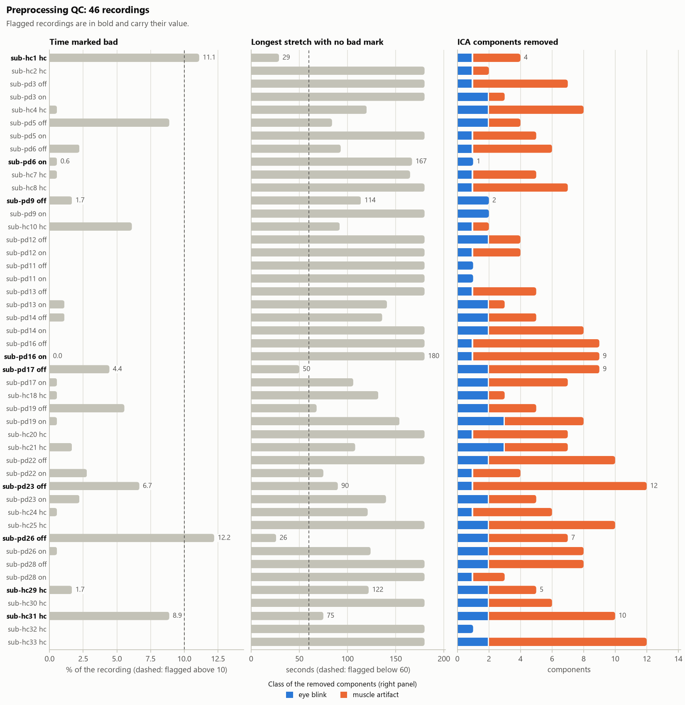

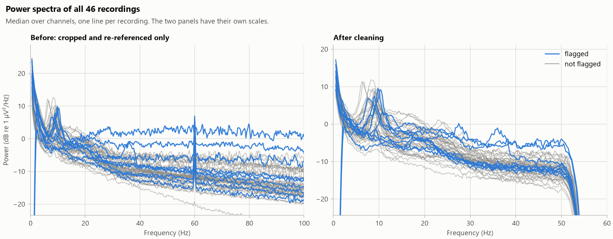

## All recordings

| Recording | Group | Start (s) | Mains (Hz) | Removed: eye / muscle / heart / line | Brain components | Variance removed (%) | Bad time (%) | Longest clean stretch (s) | Median SD (µV) | Noisiest channel (x median SD) | Figures |
|---|---|---|---|---|---|---|---|---|---|---|---|
| **sub-hc1 hc** | HC | 6.5 | 60 | 1 / 3 / 0 / 0 | 15 | 80 | 11.1 | 29 | 7.5 | F3 3.9 | [spectrum](figures/qc_preprocessing/sub-hc1_ses-hc_psd.png) [components](figures/qc_preprocessing/sub-hc1_ses-hc_ica.png) |
| sub-hc2 hc | HC | 8.9 | 60 | 1 / 1 / 0 / 0 | 20 | 79 | 0.0 | 180 | 4.9 | F7 1.3 | [spectrum](figures/qc_preprocessing/sub-hc2_ses-hc_psd.png) [components](figures/qc_preprocessing/sub-hc2_ses-hc_ica.png) |
| sub-pd3 off | PD | 10.9 | 60 | 1 / 6 / 0 / 0 | 12 | 55 | 0.0 | 180 | 4.6 | Fp2 2.9 | [spectrum](figures/qc_preprocessing/sub-pd3_ses-off_psd.png) [components](figures/qc_preprocessing/sub-pd3_ses-off_ica.png) |
| sub-pd3 on | PD | 23.9 | 60 | 2 / 1 / 0 / 0 | 19 | 68 | 0.0 | 180 | 4.7 | Oz 1.4 | [spectrum](figures/qc_preprocessing/sub-pd3_ses-on_psd.png) [components](figures/qc_preprocessing/sub-pd3_ses-on_ica.png) |
| sub-hc4 hc | HC | 0.0 | 60 | 2 / 6 / 0 / 0 | 12 | 54 | 0.6 | 120 | 4.5 | P3 1.6 | [spectrum](figures/qc_preprocessing/sub-hc4_ses-hc_psd.png) [components](figures/qc_preprocessing/sub-hc4_ses-hc_ica.png) |
| sub-pd5 off | PD | 4.1 | 60 | 2 / 2 / 0 / 0 | 20 | 57 | 8.9 | 84 | 9.8 | T7 2.0 | [spectrum](figures/qc_preprocessing/sub-pd5_ses-off_psd.png) [components](figures/qc_preprocessing/sub-pd5_ses-off_ica.png) |
| sub-pd5 on | PD | 21.8 | 60 | 1 / 4 / 0 / 0 | 13 | 51 | 0.0 | 180 | 8.8 | P8 1.2 | [spectrum](figures/qc_preprocessing/sub-pd5_ses-on_psd.png) [components](figures/qc_preprocessing/sub-pd5_ses-on_ica.png) |
| sub-pd6 off | PD | 5.0 | 60 | 1 / 5 / 0 / 0 | 18 | 65 | 2.2 | 93 | 7.4 | Fp1 2.3 | [spectrum](figures/qc_preprocessing/sub-pd6_ses-off_psd.png) [components](figures/qc_preprocessing/sub-pd6_ses-off_ica.png) |
| **sub-pd6 on** | PD | 95.6 | 60 | 1 / 0 / 0 / 0 | 21 | 51 | 0.6 | 167 | 5.3 | O1 1.9 | [spectrum](figures/qc_preprocessing/sub-pd6_ses-on_psd.png) [components](figures/qc_preprocessing/sub-pd6_ses-on_ica.png) |
| sub-hc7 hc | HC | 6.8 | 60 | 1 / 4 / 0 / 0 | 22 | 37 | 0.6 | 165 | 7.2 | T8 1.6 | [spectrum](figures/qc_preprocessing/sub-hc7_ses-hc_psd.png) [components](figures/qc_preprocessing/sub-hc7_ses-hc_ica.png) |
| sub-hc8 hc | HC | 7.0 | 60 | 1 / 6 / 0 / 0 | 4 | 55 | 0.0 | 180 | 5.5 | F3 2.4 | [spectrum](figures/qc_preprocessing/sub-hc8_ses-hc_psd.png) [components](figures/qc_preprocessing/sub-hc8_ses-hc_ica.png) |
| **sub-pd9 off** | PD | 2.9 | 60 | 2 / 0 / 0 / 0 | 10 | 81 | 1.7 | 114 | 4.8 | F7 5.3 | [spectrum](figures/qc_preprocessing/sub-pd9_ses-off_psd.png) [components](figures/qc_preprocessing/sub-pd9_ses-off_ica.png) |
| sub-pd9 on | PD | 3.7 | 60 | 2 / 0 / 0 / 0 | 11 | 93 | 0.0 | 180 | 6.0 | Oz 1.8 | [spectrum](figures/qc_preprocessing/sub-pd9_ses-on_psd.png) [components](figures/qc_preprocessing/sub-pd9_ses-on_ica.png) |
| sub-hc10 hc | HC | 4.4 | 60 | 1 / 1 / 0 / 0 | 16 | 44 | 6.1 | 92 | 7.5 | FC2 3.1 | [spectrum](figures/qc_preprocessing/sub-hc10_ses-hc_psd.png) [components](figures/qc_preprocessing/sub-hc10_ses-hc_ica.png) |
| sub-pd12 off | PD | 7.5 | 60 | 2 / 2 / 0 / 0 | 22 | 40 | 0.0 | 180 | 7.9 | T8 2.0 | [spectrum](figures/qc_preprocessing/sub-pd12_ses-off_psd.png) [components](figures/qc_preprocessing/sub-pd12_ses-off_ica.png) |
| sub-pd12 on | PD | 3.7 | 60 | 1 / 3 / 0 / 0 | 22 | 49 | 0.0 | 180 | 7.6 | T7 1.5 | [spectrum](figures/qc_preprocessing/sub-pd12_ses-on_psd.png) [components](figures/qc_preprocessing/sub-pd12_ses-on_ica.png) |
| sub-pd11 off | PD | 3.1 | 60 | 1 / 0 / 0 / 0 | 23 | 14 | 0.0 | 180 | 7.2 | PO4 1.4 | [spectrum](figures/qc_preprocessing/sub-pd11_ses-off_psd.png) [components](figures/qc_preprocessing/sub-pd11_ses-off_ica.png) |
| sub-pd11 on | PD | 4.0 | 60 | 1 / 0 / 0 / 0 | 21 | 27 | 0.0 | 180 | 7.3 | T7 1.4 | [spectrum](figures/qc_preprocessing/sub-pd11_ses-on_psd.png) [components](figures/qc_preprocessing/sub-pd11_ses-on_ica.png) |
| sub-pd13 off | PD | 4.5 | none | 1 / 4 / 0 / 0 | 17 | 54 | 0.0 | 180 | 4.2 | O2 1.5 | [spectrum](figures/qc_preprocessing/sub-pd13_ses-off_psd.png) [components](figures/qc_preprocessing/sub-pd13_ses-off_ica.png) |
| sub-pd13 on | PD | 3.2 | 60 | 2 / 1 / 0 / 0 | 20 | 35 | 1.1 | 141 | 4.4 | F7 1.7 | [spectrum](figures/qc_preprocessing/sub-pd13_ses-on_psd.png) [components](figures/qc_preprocessing/sub-pd13_ses-on_ica.png) |
| sub-pd14 off | PD | 2.7 | 60 | 2 / 3 / 0 / 0 | 18 | 49 | 1.1 | 136 | 6.2 | O1 1.6 | [spectrum](figures/qc_preprocessing/sub-pd14_ses-off_psd.png) [components](figures/qc_preprocessing/sub-pd14_ses-off_ica.png) |
| sub-pd14 on | PD | 5.9 | 60 | 2 / 6 / 0 / 0 | 15 | 57 | 0.0 | 180 | 5.5 | O1 1.7 | [spectrum](figures/qc_preprocessing/sub-pd14_ses-on_psd.png) [components](figures/qc_preprocessing/sub-pd14_ses-on_ica.png) |
| sub-pd16 off | PD | 4.0 | 60 | 1 / 8 / 0 / 0 | 15 | 65 | 0.0 | 180 | 5.2 | O2 1.4 | [spectrum](figures/qc_preprocessing/sub-pd16_ses-off_psd.png) [components](figures/qc_preprocessing/sub-pd16_ses-off_ica.png) |
| **sub-pd16 on** | PD | 0.0 | none | 1 / 8 / 0 / 0 | 18 | 31 | 0.0 | 180 | 4.7 | O1 1.9 | [spectrum](figures/qc_preprocessing/sub-pd16_ses-on_psd.png) [components](figures/qc_preprocessing/sub-pd16_ses-on_ica.png) |
| **sub-pd17 off** | PD | 2.4 | 60 | 2 / 7 / 0 / 0 | 10 | 82 | 4.4 | 50 | 6.8 | Fp1 3.3 | [spectrum](figures/qc_preprocessing/sub-pd17_ses-off_psd.png) [components](figures/qc_preprocessing/sub-pd17_ses-off_ica.png) |
| sub-pd17 on | PD | 3.7 | 60 | 2 / 5 / 0 / 0 | 9 | 89 | 0.6 | 106 | 5.2 | Fp1 2.3 | [spectrum](figures/qc_preprocessing/sub-pd17_ses-on_psd.png) [components](figures/qc_preprocessing/sub-pd17_ses-on_ica.png) |
| sub-hc18 hc | HC | 3.0 | 60 | 2 / 1 / 0 / 0 | 22 | 37 | 0.6 | 132 | 4.8 | F7 1.5 | [spectrum](figures/qc_preprocessing/sub-hc18_ses-hc_psd.png) [components](figures/qc_preprocessing/sub-hc18_ses-hc_ica.png) |
| sub-pd19 off | PD | 2.2 | 60 | 2 / 3 / 0 / 0 | 20 | 62 | 5.6 | 68 | 7.9 | F7 1.8 | [spectrum](figures/qc_preprocessing/sub-pd19_ses-off_psd.png) [components](figures/qc_preprocessing/sub-pd19_ses-off_ica.png) |
| sub-pd19 on | PD | 5.4 | 60 | 3 / 5 / 0 / 0 | 16 | 71 | 0.6 | 154 | 7.5 | T7 2.0 | [spectrum](figures/qc_preprocessing/sub-pd19_ses-on_psd.png) [components](figures/qc_preprocessing/sub-pd19_ses-on_ica.png) |
| sub-hc20 hc | HC | 2.0 | 60 | 1 / 6 / 0 / 0 | 15 | 28 | 0.0 | 180 | 4.1 | PO3 2.3 | [spectrum](figures/qc_preprocessing/sub-hc20_ses-hc_psd.png) [components](figures/qc_preprocessing/sub-hc20_ses-hc_ica.png) |
| sub-hc21 hc | HC | 5.9 | none | 3 / 4 / 0 / 0 | 19 | 78 | 1.7 | 108 | 6.7 | Fp1 2.7 | [spectrum](figures/qc_preprocessing/sub-hc21_ses-hc_psd.png) [components](figures/qc_preprocessing/sub-hc21_ses-hc_ica.png) |
| sub-pd22 off | PD | 4.0 | 60 | 2 / 8 / 0 / 0 | 17 | 82 | 0.0 | 180 | 6.1 | P4 1.5 | [spectrum](figures/qc_preprocessing/sub-pd22_ses-off_psd.png) [components](figures/qc_preprocessing/sub-pd22_ses-off_ica.png) |
| sub-pd22 on | PD | 2.3 | 60 | 1 / 3 / 0 / 0 | 18 | 83 | 2.8 | 75 | 7.2 | Fp2 2.3 | [spectrum](figures/qc_preprocessing/sub-pd22_ses-on_psd.png) [components](figures/qc_preprocessing/sub-pd22_ses-on_ica.png) |
| **sub-pd23 off** | PD | 12.8 | none | 1 / 11 / 0 / 0 | 10 | 69 | 6.7 | 90 | 6.1 | FC5 2.2 | [spectrum](figures/qc_preprocessing/sub-pd23_ses-off_psd.png) [components](figures/qc_preprocessing/sub-pd23_ses-off_ica.png) |
| sub-pd23 on | PD | 3.4 | 60 | 2 / 3 / 0 / 0 | 15 | 74 | 2.2 | 140 | 5.4 | F4 1.8 | [spectrum](figures/qc_preprocessing/sub-pd23_ses-on_psd.png) [components](figures/qc_preprocessing/sub-pd23_ses-on_ica.png) |
| sub-hc24 hc | HC | 4.7 | 60 | 1 / 5 / 0 / 0 | 10 | 81 | 0.6 | 121 | 5.6 | P4 1.8 | [spectrum](figures/qc_preprocessing/sub-hc24_ses-hc_psd.png) [components](figures/qc_preprocessing/sub-hc24_ses-hc_ica.png) |
| sub-hc25 hc | HC | 18.2 | 60 | 2 / 8 / 0 / 0 | 6 | 88 | 0.0 | 180 | 3.2 | Fp2 3.4 | [spectrum](figures/qc_preprocessing/sub-hc25_ses-hc_psd.png) [components](figures/qc_preprocessing/sub-hc25_ses-hc_ica.png) |
| **sub-pd26 off** | PD | 6.3 | 60 | 2 / 5 / 0 / 0 | 15 | 74 | 12.2 | 26 | 8.9 | F7 2.4 | [spectrum](figures/qc_preprocessing/sub-pd26_ses-off_psd.png) [components](figures/qc_preprocessing/sub-pd26_ses-off_ica.png) |
| sub-pd26 on | PD | 29.4 | none | 2 / 6 / 0 / 0 | 16 | 82 | 0.6 | 124 | 6.4 | Oz 1.7 | [spectrum](figures/qc_preprocessing/sub-pd26_ses-on_psd.png) [components](figures/qc_preprocessing/sub-pd26_ses-on_ica.png) |
| sub-pd28 off | PD | 14.4 | none | 2 / 6 / 0 / 0 | 17 | 72 | 0.0 | 180 | 5.7 | Fp1 2.4 | [spectrum](figures/qc_preprocessing/sub-pd28_ses-off_psd.png) [components](figures/qc_preprocessing/sub-pd28_ses-off_ica.png) |
| sub-pd28 on | PD | 12.9 | 60 | 1 / 2 / 0 / 0 | 22 | 28 | 0.0 | 180 | 5.8 | T7 1.3 | [spectrum](figures/qc_preprocessing/sub-pd28_ses-on_psd.png) [components](figures/qc_preprocessing/sub-pd28_ses-on_ica.png) |
| **sub-hc29 hc** | HC | 4.1 | 60 | 2 / 3 / 0 / 0 | 19 | 61 | 1.7 | 122 | 6.2 | T7 4.9 | [spectrum](figures/qc_preprocessing/sub-hc29_ses-hc_psd.png) [components](figures/qc_preprocessing/sub-hc29_ses-hc_ica.png) |
| sub-hc30 hc | HC | 3.3 | 60 | 2 / 4 / 0 / 0 | 10 | 93 | 0.0 | 180 | 4.8 | Pz 1.6 | [spectrum](figures/qc_preprocessing/sub-hc30_ses-hc_psd.png) [components](figures/qc_preprocessing/sub-hc30_ses-hc_ica.png) |
| **sub-hc31 hc** | HC | 4.6 | none | 2 / 8 / 0 / 0 | 12 | 42 | 8.9 | 75 | 4.2 | O1 10.6 | [spectrum](figures/qc_preprocessing/sub-hc31_ses-hc_psd.png) [components](figures/qc_preprocessing/sub-hc31_ses-hc_ica.png) |
| sub-hc32 hc | HC | 9.9 | none | 1 / 0 / 0 / 0 | 19 | 15 | 0.0 | 180 | 4.3 | F8 1.3 | [spectrum](figures/qc_preprocessing/sub-hc32_ses-hc_psd.png) [components](figures/qc_preprocessing/sub-hc32_ses-hc_ica.png) |
| sub-hc33 hc | HC | 7.5 | none | 2 / 10 / 0 / 0 | 13 | 68 | 0.0 | 180 | 3.5 | PO3 2.0 | [spectrum](figures/qc_preprocessing/sub-hc33_ses-hc_psd.png) [components](figures/qc_preprocessing/sub-hc33_ses-hc_ica.png) |

Flagged recordings are in bold. Start is where the kept window begins in the original file. Brain components is how many of the ICA components ICLabel calls brain. Data rank before ICA: 31.

## Figures for the flagged recordings

### sub-hc1 hc

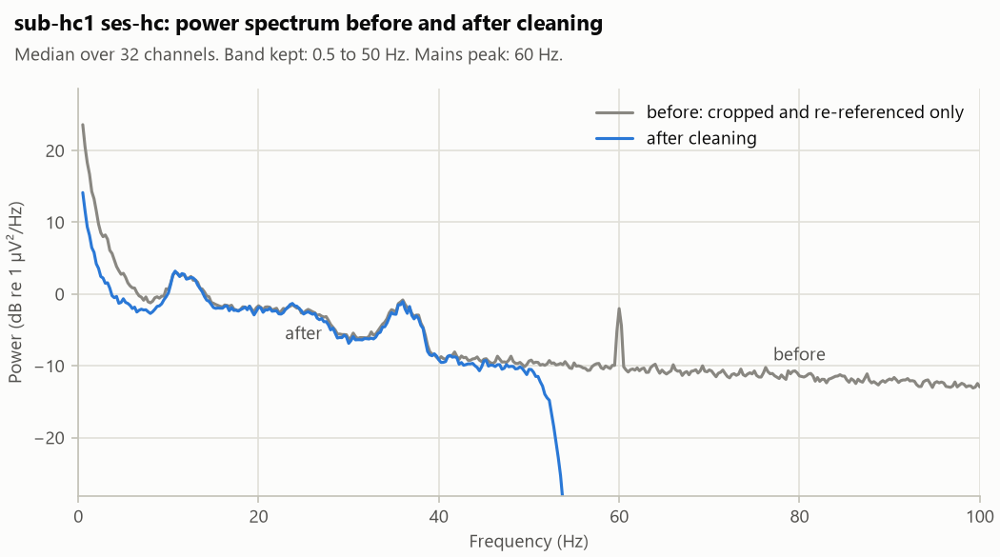

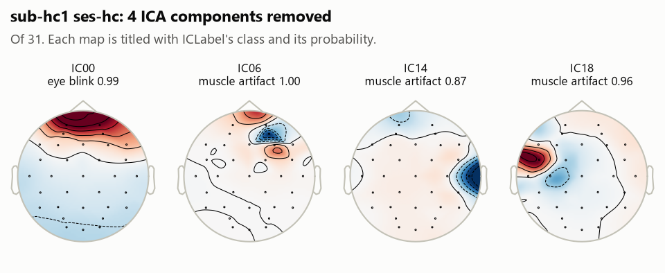

### sub-pd6 on

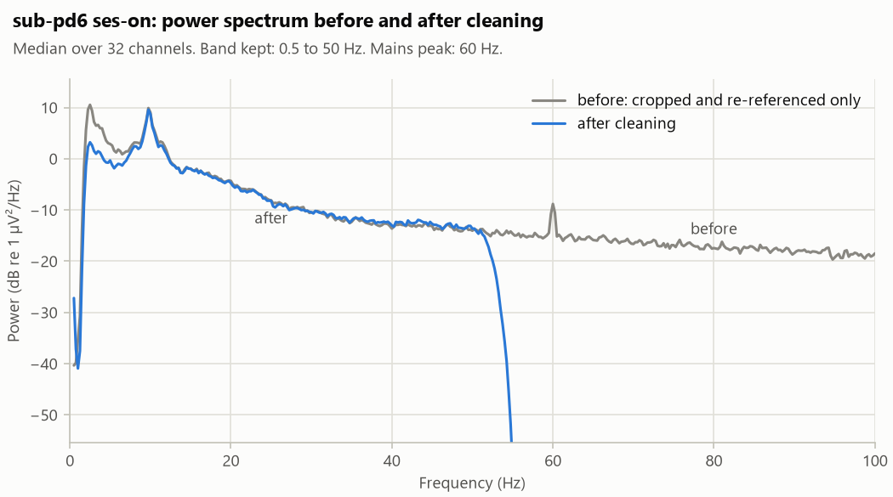

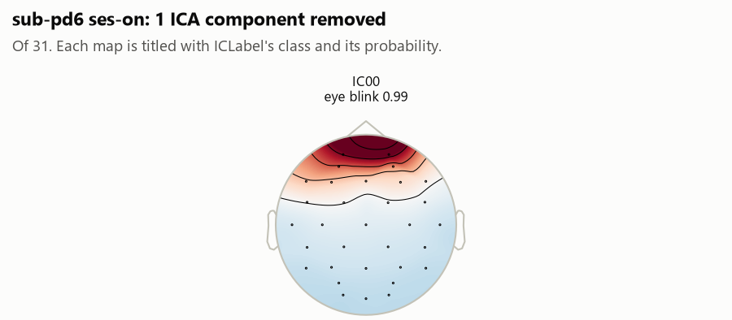

### sub-pd9 off

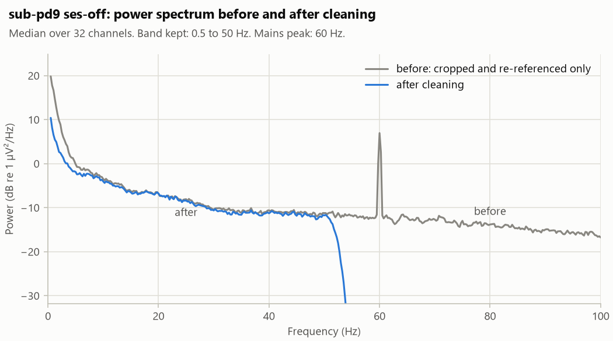

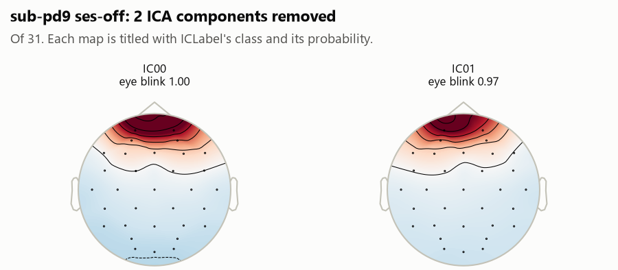

### sub-pd16 on

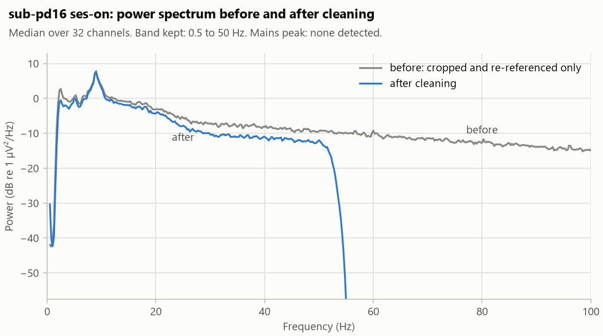

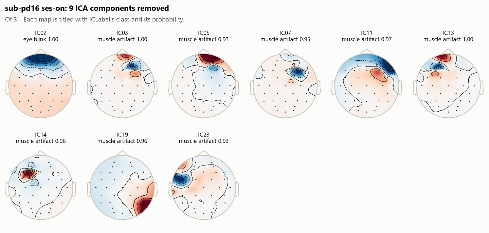

### sub-pd17 off

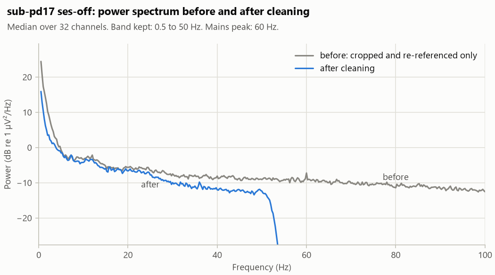

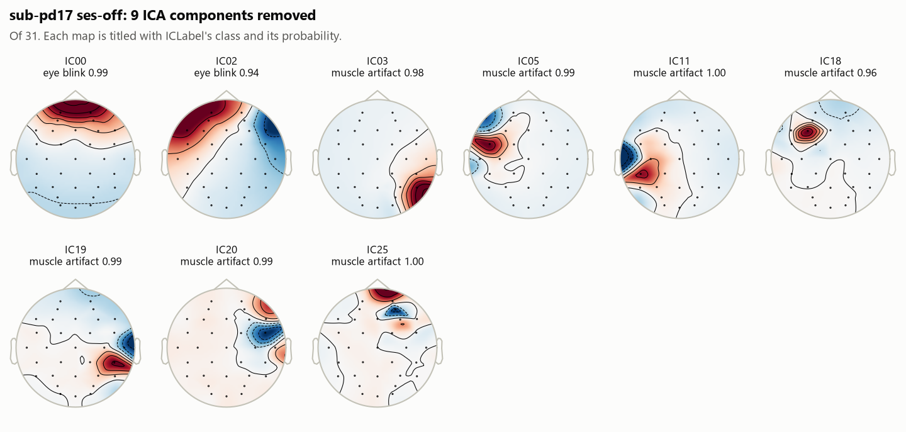

### sub-pd23 off

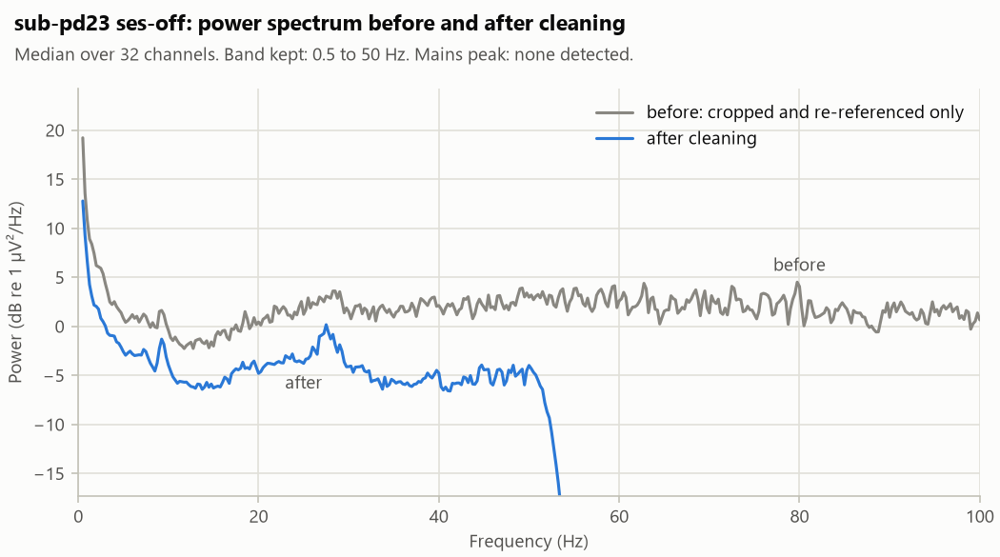

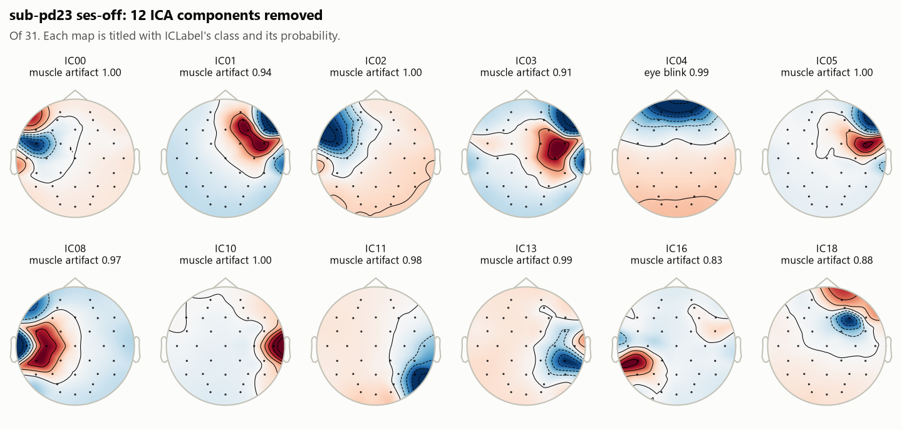

### sub-pd26 off

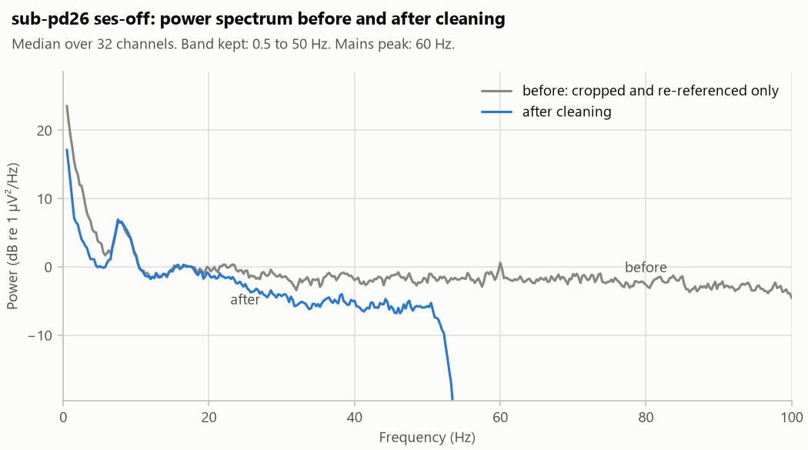

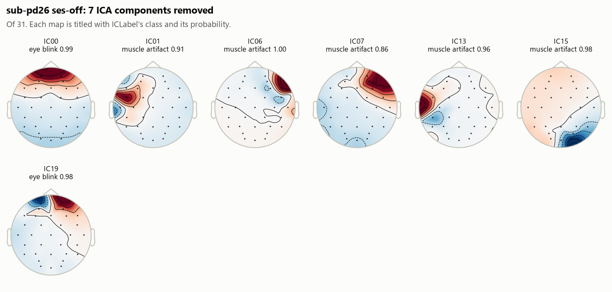

### sub-hc29 hc

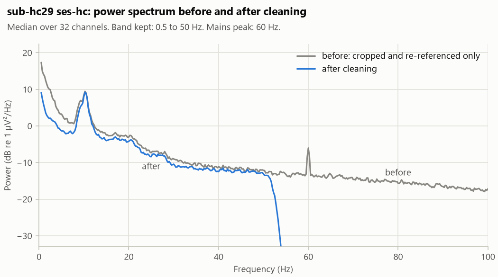

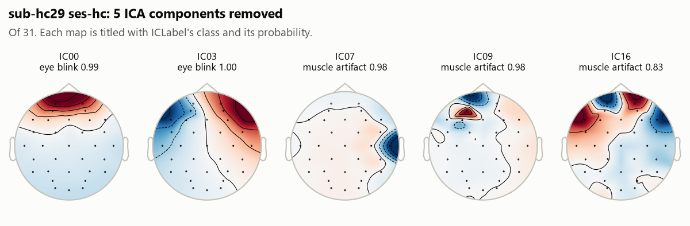

### sub-hc31 hc

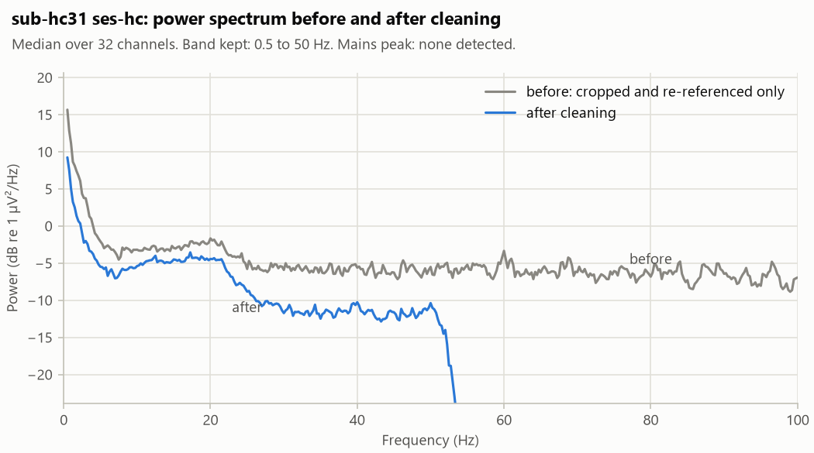

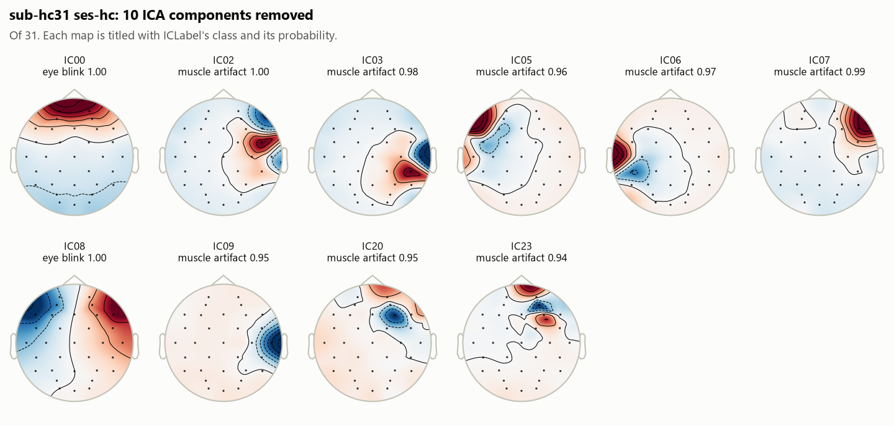
